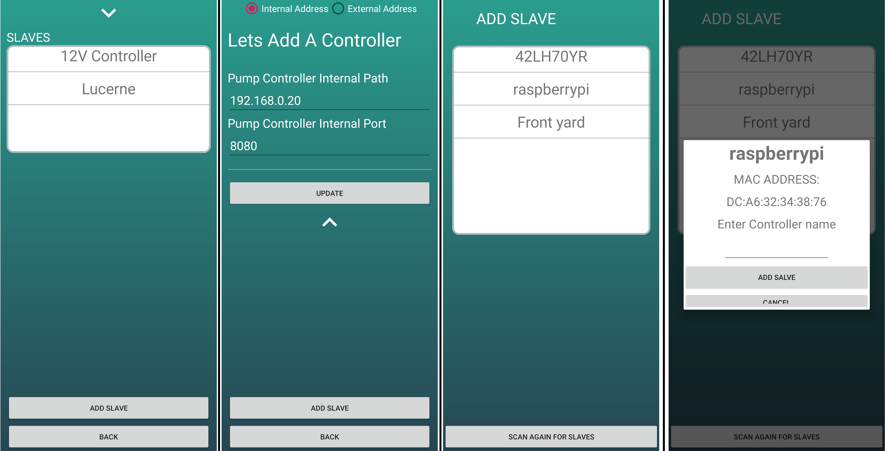
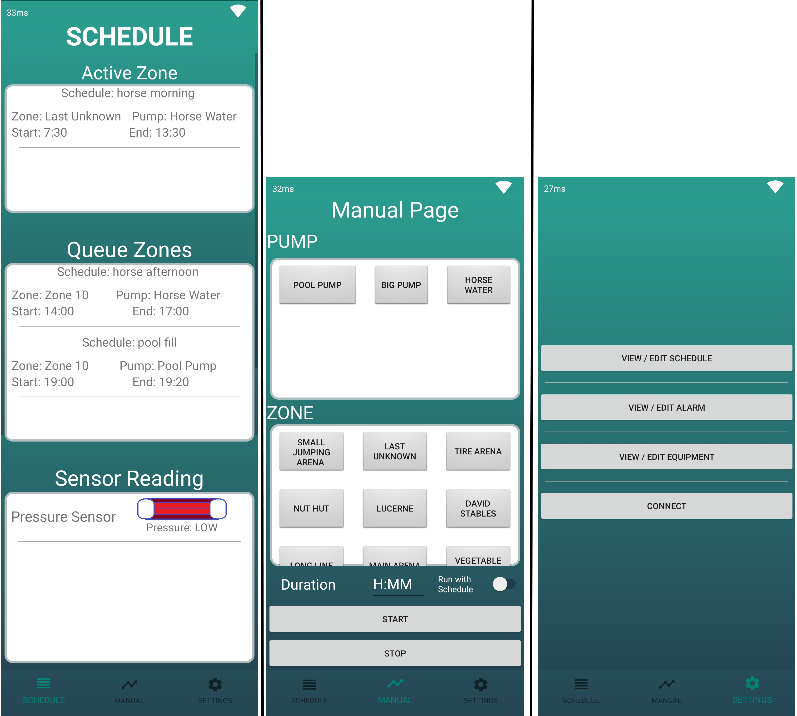
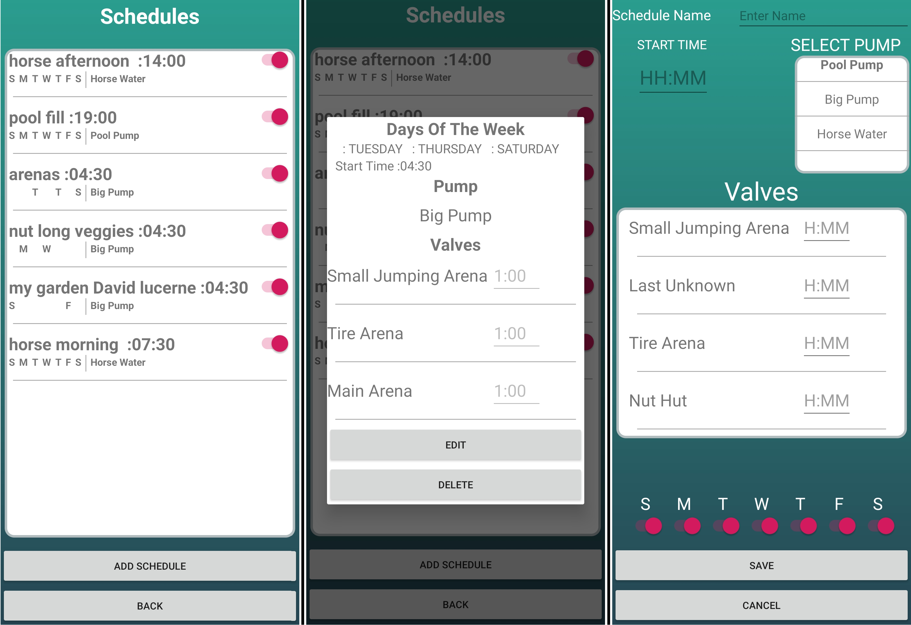
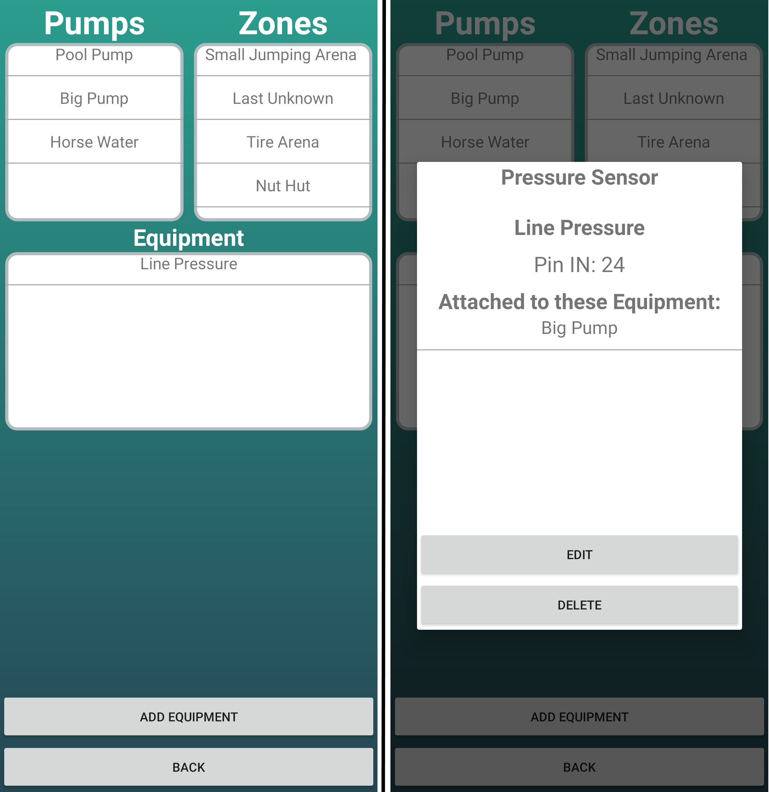

# Irrigation-android

The image on the left depicts what the user sees once connected to the system. It allows the user to view all of the connected subsystems ('slaves') as well as to delete them. If a 'slave' is deleted, all the equipment and schedules of that 'slave' will also be deleted from the 'master'. Selecting the arrow at the top centre of the screen will drop down the connection screen, which allows the user to edit internal and external connections to the system. On this page, the user can also connect to different systems, but only if it finds the connection valid. If a user decides to add a 'slave', the system will scan for nearby devices through its built-in bluetooth. These devices will then be displayed on the screen for the user to select. If a device is selected, it will ask the user to enter a name for the subsystem ('slave'), as shown in the image on the right. When the 'slave' is connecting to the 'master', the 'master' will determine if a LoRa is attached; otherwise, it will use the default LAN connection.

At the top of each screen, the user can see the connection status, which is represented by the WiFi icon. The image on the left depicts the screen where the user can see the active schedules, queued schedules, and all the sensor readings. The image in the middle depicts the next navigation screen, which is the manual page. Here users can select pumps and/or zones they wish to run once-off and set the duration. If they want the current schedules to continue while the manual action is running, they will select "run with schedule"; otherwise, the active schedule will be overridden. The manual action can also be stopped by selecting "stop". On the settings screen, the user has the option to view or edit schedule, alarm, and equipment, as well as the option to edit the connection.

This image depicts the schedule page where users are able to view all their schedules and turn them on and off. It also shows basic information, such as the days for which it is scheduled and which pump it uses. When a schedule is selected, a detailed description of the schedule is presented to the user, as well as the option to edit and delete it (see second image). When users select "add schedule", the screen on the right appears. The user can then enter the name of the schedule, the starting time, which pump it makes use of, and the day(s) of the week the scheduled item will run. The valves used can be selected by entering the duration next to the appropriate valve; those without a duration will automatically be excluded.

This image will appear if the user selects "view/edit equipment". It displays all the pumps, zones and equipment to the user. When one is selected, a detailed description of the item is presented to the user as well as the option to edit or delete the item. If the user edits or deletes the item, the 'master' will communicate this to the 'slave' in order to make sure that the action is performed.

